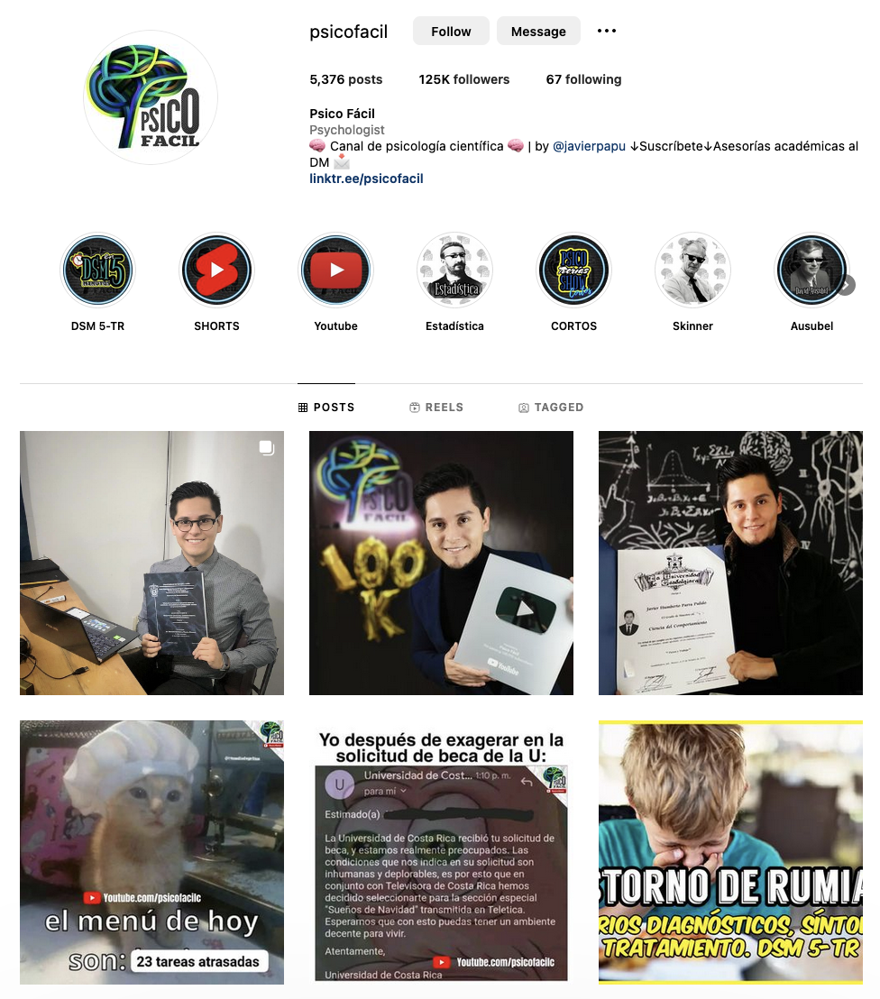
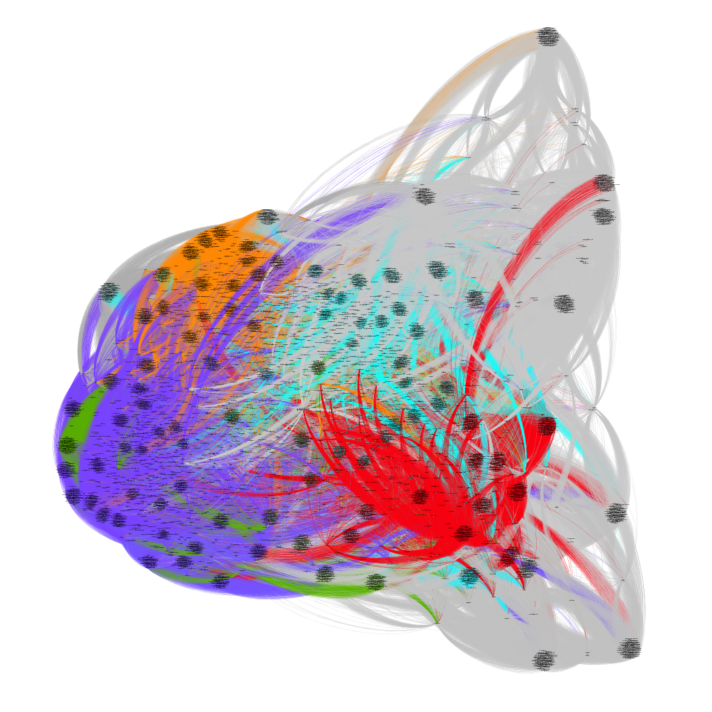
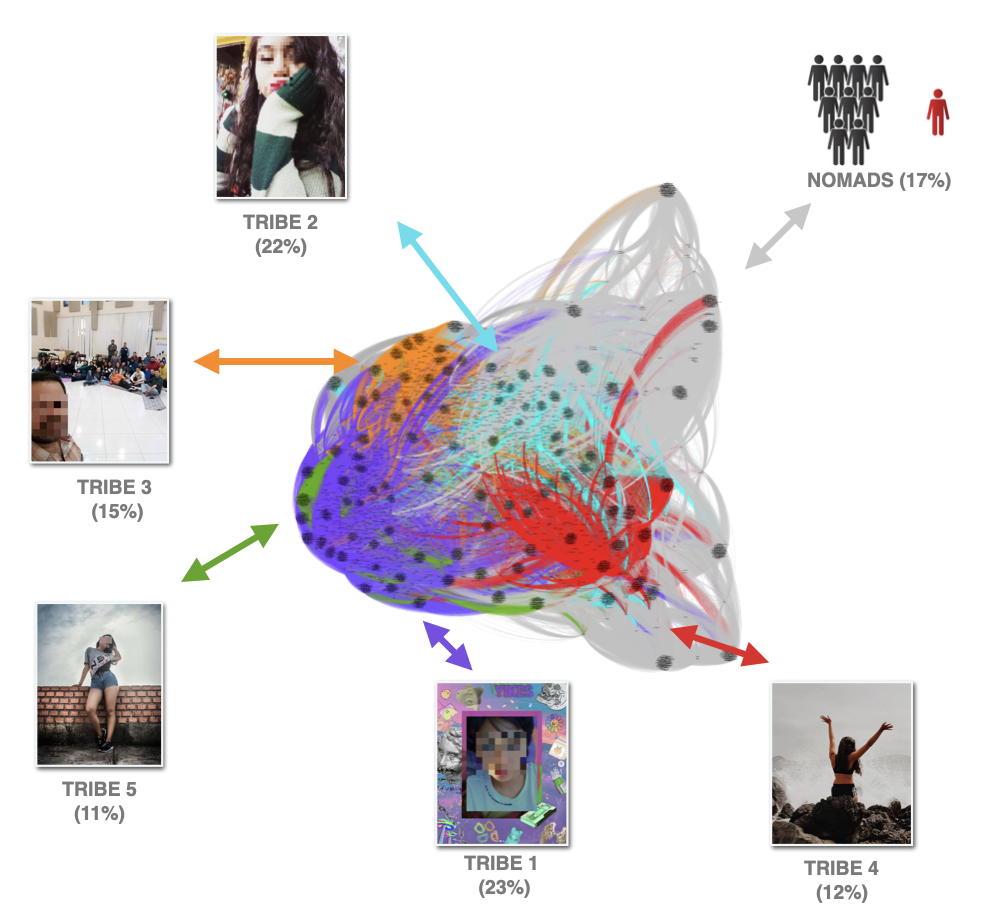
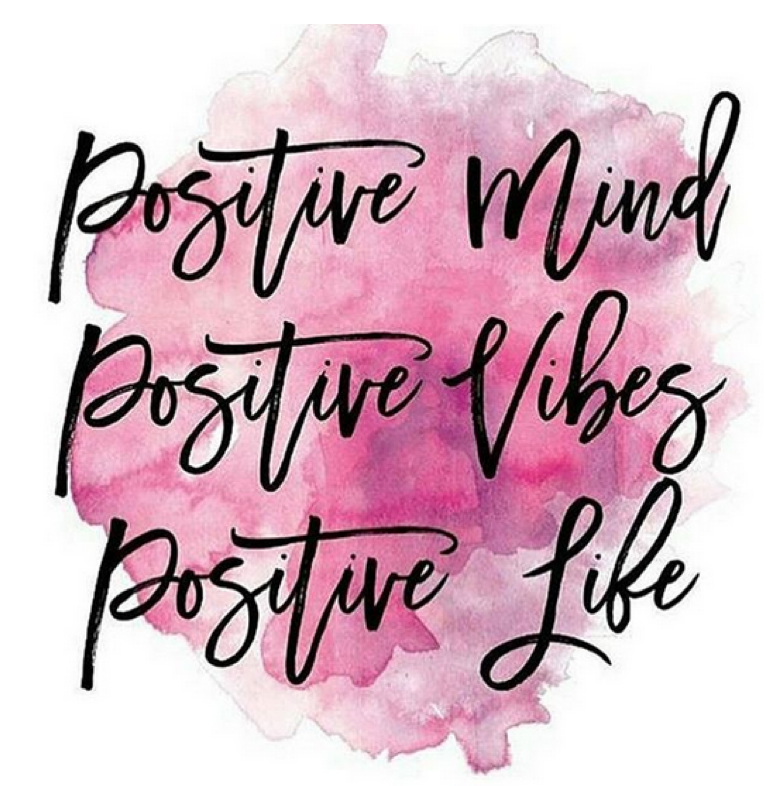

This is a repurposed analysis of an online course I authored and published on [Antropomedia Academy](https://campus.antropomedia.academy/courses/metodos-digitales-para-profesionales-de-la-salud).

{}

**PROJECT SUMMARY**

- This project uses `sociograms` - networks of social media users and their online interactions - and `digital anthropology` - the study of human behavior on online channels - to analyze the marketing strategies of successful Latin American healthcare professionals on Instagram.
- The analysis reveals distinct market segments which healthcare professionals in Latin America can tap into, ranging from people that talk about self-love to users that present themselves as models.
- From these market segments, there are multiple shared meanings and social representations that healthcare professionals can emulate to reach their target audience, such as posting memes related to healthcare or divulging scientific information.
- Once we have the data and actionable insights, it is up to each content creator and organization to ponder the feasibility and ethics of the strategy to develop.
- This project is purposely shallow. If you want to learn more, I invite you to check out the full scoop with [Antropomedia](https://antropomedia.agency/?lang=en)!

{}

---

The COVID-19 pandemic highlighted the ambivalent nature of social media: It is a powerful tool that can be used to connect with others, but you can also get lost in the noise and can be subject to misinformation.

I devised this course to study user behavior on Instagram with regards to healthcare so that professionals and organizations can make informed decisions when it comes to crafting their own marketing strategies.

Additionally, I go over the concepts and technology used to inform this analysis, covering topics such as network analysis and digital anthropology.

This project is divided as follows:
1. Explaining the concepts and technology
2. Analyzing user behavior using networks and digital ethnography
3. Crafting your own marketing strategy

---

# 1. Explaining The Concepts and Technology



- Sociogram: Visualization or graphic that depicts interactions between people through nodes and edges - in this context, the nodes are social media users and the edges are interactions between them (either because they engaged with the same social media posts or because they follow each other).
- Digital Footprint: The traces of digital data we leave behind anytime we engage, interact, or create something online.
- Digital Tribe: Concept inspired by the sociologist Michel Maffesoli. It refers to a group of people online with one or multiple shared interests, where these shared interests are an important part of each individual's online identity. In business terms, these would represent the market segments.
- Digital Public Space: The point of reunion for multiple users online - in this case, each professional and organization's account represents a a digital public space.
- Digital Community: Concept inspired by McMillan and Chavis' concept of sense of community. It refers to the "map" of the people that congregate based on shared interests within a digital public space.
- Digital Ethnography: Inspired by the sociologist Christine Hine, it is a wide array of research methods that encompasses other concepts such as netnography (discourse analysis within big data), totems (symbols), and social representations (themes).



There are many ways one can approach social media, and there are surely thousands of gurus and researchers that will teach you their own approach.

In that regard, this project is heavily influenced by Antropomedia's [unique vision on social media](https://antropomedia.agency/?lang=en) which has helped hundreds of organizations - from small businesses to world-renowned enterprises - increase their reach, value, and profitability.

This vision involves integrating proprietary data science methods to download and visualize the data, and social science concepts to make sense of this information.

## Digital Anthropology

Most social science concepts used in this project derive from digital anthropology, which is a subfield of anthropology.

The core idea of this discipline is that it aims to understand life as understood by people in the light of digital environments.

It is also worth noting that it is an interdisciplinary line of study, therefore concepts from other fields - such as sociology and social psychology - are drawn in to fully comprehend online behavior.

## Network Analysis

This social media vision would not be possible without the premise behind the digital world: Most individuals have a social media profile or account and they leave behind a digital trace (or footprint) of their online behavior.

Further, certain bits and pieces of this digital footprint can be publicly viewed and downloaded online without being unethical or infringing privacy policies (to illustrate: think of how you can view who likes or comments a post on Facebook).

Once this data is downloaded, network analysis enables a way to view and study this information. Put simply, network are a compilation of nodes (dots in a 2D space) connected through edges (the lines that connect each dot in a network).

In this context, the nodes are social media profiles and the edges that connect each node are relationships between users (either because they engaged with the same posts or because they follow each other).



---

# 2. Analyzing User Behavior Using Networks and Digital Ethnography

## Digital Public Space

The full course dives deep into 3 social media accounts - for simplicity, this project will focus on analyzing 1.

The digital public space (social media account) analyzed in this project is called `@psicofacil` on Instagram, which at the time of the analysis had 104K followers (but as of the time of this writing, now has 125K):
- He is a psychologist, neuroscientist, and educator from Colombia.
- His brand is dedicated to disseminating evidence-based psychology through memes, tutorials, and personal accomplishments.
- He also has a YouTube channel which was not within the scope of this project.

## Social Network (Sociogram)

Data is downloaded using Antropomedia's proprietary technology which resulted in a sample of nearly 7K nodes (social media users) and 1.2M edges (users engaging with the same social media posts).

Below is the resulting sociogram, where each color represents a different digital tribe (market segment) and those in gray are nomads (people unrelated to each other and without a clear relationship with the brand's communication).

## Digital Tribes

Using maps as an analogy, a sociogram can show us the regions (digital tribes) and aspects such as the steps needed to reach from one point to another (in network analysis, this would correspond to quantitative metrics such as centrality).

But same as with a map, this does not tell us the qualities of a region - and sometimes not even names of the regions are provided, especially if it is an uncharted territory. In describing a map's regions is where digital ethnography comes in.

After diving deep into the sociogram - i.e., analyzing hundreds or thousands of social media profiles - we can get a better understanding of each digital tribe.

Below is a snippet of the sociogram with digital tribes - the faces have been blurred and the names have been changed for privacy purposes. Continue scrolling for an overview of what each market segment stands for.

Digital tribes overview:
- Tribe 1 are all about showing themselves as creative people, while also being conscious (and critical) of their surroundings.
- Tribe 2 are characterized by posting mostly pictures of themselves (selfies) accompanied with messages of positivity, self-esteem and self-love.
- Tribe 3 are people who work within healthcare (namely psychologists) and value professional growth and scientific facts.
- Tribe 4 are people who show their profiles through sublime experiences, such as traveling or spending time with their loved ones.
- Tribe 5 are individuals who value their personal appearance and will usually appear posting full-bodied pictures of themselves.

## Totems
In parallel with developing a description of our market segments, we can locate other actionable insights - such as totems (symbols) and social representations (themes) - that can can help further create and refine a marketing strategy.

Using the previous digital tribes as an example, these are some common elements we can find:
- Tribe 1 are all about being creative and critical, hence one method to emulate their discourse is by posting thoughts and facts in an artistic way.
- Tribe 2 value self-care, therefore some ways to connect with them is by posting motivational content, talking about caring for oneself, or even through humorous content.
- Tribe 3 value information and professional growth, therefore showing achievements and sharing scientific facts is a proper way to connect.
- Tribe 4 value experiences and one way to connect with them is through aesthetic images, thoughtful words, and posting moments of joy.
- Tribe 5 value looking and feeling good, so you can connect by posting enjoyable content (visually appealing, funny, aesthetic).

Below is just one example of a real image posted by a Tribe 2 on social media, where the highlight is that this is content that anyone can replicate - and in doing so, you are immediately connecting with this market segment.

---

# 3. Crafting Your Own Marketing Strategy

At this point, we are able to uncover distinct market segments and these market segments are based on user's actual behavior, rather than how we *think* they behave - and perhaps most importantly, **we know what they value**.

Not only that, but if we analyze other social media profiles (contrast accounts), we have a big enough sample to say we have a pulse of the market, therefore we can make an informed decision of what course of action to take.

From here, it is up to the person or organization to ponder the findings and figure what fits best for the objective at hand. 

This process involves thinking about authenticity - i.e., does a certain strategy align with my core values? Or, is this how I want to portray myself and my brand?

Lastly, defining a strategy also implies thinking about ethics. Even if you are not a healthcare provider, you are putting your content out for the world to see. And ideal question would be to ask: Is this information factual and will it help myself as well as others?

{}

If you've made it this far: Thank you for reading! 

Remember that this project is purposely shallow. If you want to learn more about this topic, I invite you to check out the full scoop with [Antropomedia](https://antropomedia.agency/?lang=en)!

{}
