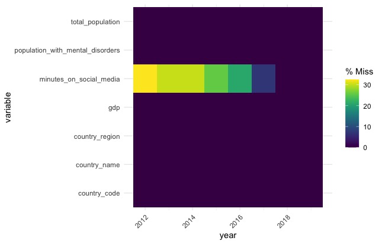
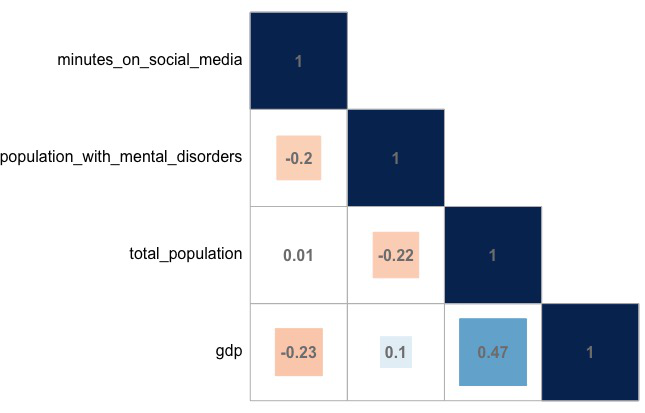

This is a repurposed analysis of a final project made for graduate-level Data Science class.

{}

**PROJECT SUMMARY**

- This project aims to explore the relationship between mental disorders and social media by looking at several country-level indicators.

- To do so, this project downloads, cleans and analyzes data provided by the Institute for Health Metrics and Evaluation, the World Bank, and the Global Web Index using R and Tableau.

- Even though the analysis reveals that more time on social media does not equate to greater mental health issues, this project has limitations like the quality of the data.

{}

---

It is no surprise to say that social media plays an important role in a lot of people's daily lives. And even though a single Google search with the key words "social media mental health" leads to the inevitable conclusion that spending more time on social media leads to greater mental health issues - is that really the case?

The present project aims to explore this social media-mental heatlh relationship, having as the main question: **How does this relationship between social media use and mental health actually look like?**

This post is divided as follows:

1. Explaiingn the data
2. Cleaning the data
3. Analyzing the data
4. Coming to conclusions

---

# Explaining The Data
To approach the question in hand, the analysis focuses on a high-level relationship, specifically looking at indicators for both **daily** **social media use and mental disorder prevalence at a country level**.

## Social Media Data

Surprisingly or not, data on how people or countries use social media (or the internet for that matter) is scarce.

Given this scarcity and the available options, the data used is provided by the Global Web Index (also known as GWI or GlobalWebIndex). 

GWI is a global market research company that annually publishes a flagship report which contains diverse consumer metrics. In particular, [GWI's 2019 flagship report](https://www.gwi.com/hubfs/Downloads/2019%20Q1%20Social%20Flagship%20Report.pdf) asks 1.7 million internet users aged 16-64 how many hours they spend connected to social network services during a typical day, yielding results for 45 countries.

As a plus, this report includes results for previous years, spanning from 2012 through 2019. The data on page 8 of this report is manually transcribed to a CSV file, which will result in **one metric that measures how many minutes (on average) a person will spend on social media per day, by country and by year.**

## Mental Health Data

Data on mental health is chosen in function of the data available on social media, especially in terms of selecting age range.

This indicator is sourced from the Global Burden of Disease Study (GDB) carried out by the Institute for Health Metrics and Evaluation (IHME). 

The IMHE is an international, intergovernmental institute, that has created an [interactive database](https://vizhub.healthdata.org/gbd-results/) in collaboration with thousands of researchers and policymakers to reflect recent data on over 300 diseases for over 200 countries. 

For this article, the data is first downloaded "as is" from their online portal, which will result in **one metric that indicates the percentage of a country's population with mental disorders in any given year** (i.e., occurrence of mental disorders over its total population in that year). The parameters for downloading the data are as follows:

-   GBD Estimate: Cause of death or injury

-   Measure: Prevalence

-   Metric: Percent

-   Cause: Mental Disorders

-   Location: Select all countries and territories

-   Age: 10-54 years

-   Sex: Both

-   Annual rate of change: Deactivated

-   Year: 2012 through 2019

## Socioeconomic Data

Besides the data on mental health and social media use, we will be adding socioeconomic indicators into the mix. 

In particular, we will use World Bank indicators - [total population](https://data.worldbank.org/indicator/SP.POP.TOTL) and [gross domestic product (GDP)](https://data.worldbank.org/indicator/NY.GDP.MKTP.CD) - which will are ingested via the `wbstats` package.

---

# Cleaning The Data

There are several data wrangling steps implemented in R once the raw data is downloaded. These include renaming columns, converting units of measurement, and joining all data sources into a single dataframe.

The steps followed and code used are denoted below.


```r
# read in raw datasets
social_media <- read_csv("GWI_socialmedia_2019.csv")
mental_health <- read_csv("IMHE_mentaldisorders_2019.csv")

# read and wrangle mental health data
mental_health <- mental_health %>%
  select(location_name, year, val) %>%
  rename(country_name = location_name, population_with_mental_disorders = val) %>%
  mutate(country_code = countrycode(sourcevar = country_name, origin = "country.name", destination = "iso3c"))

# read and wrangle social media data
social_media <- social_media %>%
  mutate(country_code = countrycode(sourcevar = country_name, origin = "country.name", destination = "iso3c")) %>%
  mutate(social_media_use = hms(social_media_use)) %>% # split hours, minutes and seconds
  mutate(social_media_use = hour(social_media_use)*60 + minute(social_media_use)) %>% #to get total minutes spent on social media
  rename(minutes_on_social_media = social_media_use) %>%
  select(country_code, year, minutes_on_social_media) # dropping country_name

# merge social media and mental health dataframes
mental_health_social_media <- merge(mental_health, social_media, 
                                    by=c("country_code", "year"))

# add country region
mental_health_social_media <- mental_health_social_media %>%
  mutate(country_region = countrycode(sourcevar = country_name, origin = "country.name", destination = "region"))

# read in socioeconomic data
socioeconomic_indicators <- wb_data(
  indicator = c("SP.POP.TOTL","NY.GDP.MKTP.CD") #World Bank codes for GDP and total population
  , country = c("countries_only") , start_date = 2012
  , end_date = 2019
  )

# wrangle socioeconomic data
socioeconomic_indicators <- socioeconomic_indicators %>%
  rename(country_code = iso3c, year = date, total_population = SP.POP.TOTL, gdp = NY.GDP.MKTP.CD) %>%
  select(country_code, year, total_population, gdp) #dropping country name and two-digit code

# merge socioeconomic data with social media and mental health dataframe
mental_health_social_media <- merge(
  mental_health_social_media
  , socioeconomic_indicators
  , by=c("country_code", "year")
  ) %>%
  relocate(
    country_name
    , country_code
    , country_region
    , year
    , population_with_mental_disorders
    , minutes_on_social_media
    , gdp
    , total_population
    )
```


Once data has been tidied and arranged as needed, we can use plots and analytical techniques to make sense of the data and attempt to answer the question at hand.

---

# Analyzing The Data

## Assessing Missing Values

This section will explore multiple visualizations that aim to explore the data and answer the question at hand.

First of all, and mostly as a sanity check, a visualization to observe null values is created. As explained in the first sections of the article, data on social media is scarce and, even with the best source found, it is often incomplete. 

The following visualization aims to explore this incompleteness, plus it seeks to corroborate that the data wrangling operations have been performed successfully (the remaining variables should be complete).



Upon observing this graph, we can see that, indeed, their is missing data in most of the years with regards to social media data, while the rest of the variables are complete. 

From this, confirm that the mergers have been performed correctly (i.e., we expected the World Bank and the IMHE to have complete information) plus we reiterate the state of the data on social media use (i.e., coverage is expected to increase over the years, as more data is available and internet penetration rates increase).

Having briefly explored the completeness of the data, we now focus on one of the main data: social media and mental health. 

## Global Averages Over the Years - Line Plot

A general question we could ask is: how do the global trends in mental disorders and social media use look like? The following visualization seeks to explore this by grouping the data by year, then calculating global averages and graphing them in a line plot.

<div class='tableauPlaceholder' id='viz1685916375123' style='position: relative'><noscript><a href='#'></a></noscript><object class='tableauViz'  style='display:none;'><param name='host_url' value='https%3A%2F%2Fpublic.tableau.com%2F' /> <param name='embed_code_version' value='3' /> <param name='site_root' value='' /><param name='name' value='SocialMediaandMentalHealthGlobalAverages&#47;Sheet1' /><param name='tabs' value='no' /><param name='toolbar' value='yes' /><param name='static_image' value='https:&#47;&#47;public.tableau.com&#47;static&#47;images&#47;So&#47;SocialMediaandMentalHealthGlobalAverages&#47;Sheet1&#47;1.png' /> <param name='animate_transition' value='yes' /><param name='display_static_image' value='yes' /><param name='display_spinner' value='yes' /><param name='display_overlay' value='yes' /><param name='display_count' value='yes' /><param name='language' value='en-US' /></object></div>                <script type='text/javascript'>                    var divElement = document.getElementById('viz1685916375123');                    var vizElement = divElement.getElementsByTagName('object')[0];                    vizElement.style.width='100%';vizElement.style.height=(divElement.offsetWidth*0.75)+'px';                    var scriptElement = document.createElement('script');                    scriptElement.src = 'https://public.tableau.com/javascripts/api/viz_v1.js';                    vizElement.parentNode.insertBefore(scriptElement, vizElement);                </script>

From the above graph, we can observe that both social media use and mental disorders have increased in the last years. We can also observe that social media use only increases over the years, while mental disorder prevalence saw a decrease from 2012-2014.

Prevalence of mental disorders has remained stable at around 16% of the population, versus social media use that has gone from 100 minutes per day to 140. Also worthnoting that both social media use and mental disorder prevalence observed their steepest increases from 2014-2016.

## Data Over The Years by Country - World Map

Still focusing on the trends in the main data, the graphic below is a choropleth map that is meant to explore the hours people spend on social media, as well as the prevalence of mental disorders, by country over the years.

<div class='tableauPlaceholder' id='viz1685915902600' style='position: relative'><noscript><a href='#'></a></noscript><object class='tableauViz'  style='display:none;'><param name='host_url' value='https%3A%2F%2Fpublic.tableau.com%2F' /> <param name='embed_code_version' value='3' /> <param name='site_root' value='' /><param name='name' value='SocialMediaandMentalHealthmap&#47;CountryAveragesOverTheYears' /><param name='tabs' value='no' /><param name='toolbar' value='yes' /><param name='static_image' value='https:&#47;&#47;public.tableau.com&#47;static&#47;images&#47;So&#47;SocialMediaandMentalHealthmap&#47;CountryAveragesOverTheYears&#47;1.png' /> <param name='animate_transition' value='yes' /><param name='display_static_image' value='yes' /><param name='display_spinner' value='yes' /><param name='display_overlay' value='yes' /><param name='display_count' value='yes' /><param name='language' value='en-US' /></object></div>                <script type='text/javascript'>                    var divElement = document.getElementById('viz1685915902600');                    var vizElement = divElement.getElementsByTagName('object')[0];                    vizElement.style.width='100%';vizElement.style.height=(divElement.offsetWidth*0.75)+'px';                    var scriptElement = document.createElement('script');                    scriptElement.src = 'https://public.tableau.com/javascripts/api/viz_v1.js';                    vizElement.parentNode.insertBefore(scriptElement, vizElement);                </script>

From the choropleth map we can see the change in data available on social media use for certain countries in Sub-Saharan Africa, versus the data available on mental disorders which remains constant over the years (both in terms of availability as well as amount, which is expected given that the global average on mental disorder prevalence also remains relatively constant at around 16%).

Another interesting finding is that, throughout the years, countries in Africa, Latin America and the Caribbean, set themselves as the ones where people seem to spend the most time on social networking sites, but these countries also seem to have a lesser rate of mental disorders; versus North America and Europe that seem to make less use of social media but have a higher presence of mental disorders.

## Data Over The Years by Country - Scatter Plot

To further explore what seems to be an inverse relationship between social media use and mental disorder prevalence, we create a scatter plot where the horizontal axis has social media use and the vertical axis represent mental disorder prevalence, using country region as a hue for the color and adding as a plus GDP for the data-point size.

<div class='tableauPlaceholder' id='viz1685971258299' style='position: relative'><noscript><a href='#'></a></noscript><object class='tableauViz'  style='display:none;'><param name='host_url' value='https%3A%2F%2Fpublic.tableau.com%2F' /> <param name='embed_code_version' value='3' /> <param name='site_root' value='' /><param name='name' value='SocialMediaandMentalHealthscatterplot&#47;Sheet1' /><param name='tabs' value='no' /><param name='toolbar' value='yes' /><param name='static_image' value='https:&#47;&#47;public.tableau.com&#47;static&#47;images&#47;So&#47;SocialMediaandMentalHealthscatterplot&#47;Sheet1&#47;1.png' /> <param name='animate_transition' value='yes' /><param name='display_static_image' value='yes' /><param name='display_spinner' value='yes' /><param name='display_overlay' value='yes' /><param name='display_count' value='yes' /><param name='language' value='en-US' /></object></div>                <script type='text/javascript'>                    var divElement = document.getElementById('viz1685971258299');                    var vizElement = divElement.getElementsByTagName('object')[0];                    vizElement.style.width='100%';vizElement.style.height=(divElement.offsetWidth*0.75)+'px';                    var scriptElement = document.createElement('script');                    scriptElement.src = 'https://public.tableau.com/javascripts/api/viz_v1.js';                    vizElement.parentNode.insertBefore(scriptElement, vizElement);                </script>

As expected, we see data points being added over the years which corresponds to the data availability for social media use (e.g., Colombia is only added until 2018). 

But, most importantly, we can observe the big-picture trends remain constant over the years: Europe and Central Asia are on the higher end of mental health disorders, but on the lower end of hours spent on social media.

In contrast, countries in Latin America, the Caribbean, and Sub-Saharan Africa are on the lower end of mental disorders, but higher end of hours spent on social networking sites.

This already points towards an interesting finding that actually goes against Google's common sense: social media does not equate to mental disorder - or, at the very least, the more time you spend on social media does not correlate with mental disorders.

## Social Media and Mental Health by The Numbers - Correlation Matrix

From the graph above we've suggested an interesting finding, but we've omitted total population and GDP. 

The section below is meant to explore this relation by generating a correlation matrix among the selected indicators, hence providing quantitative indicators to deny or confirm alleged relationships among variables.



From the correlation matrix we can confirm our suspicions: there is indeed an inverse relationship between daily hours spent on social media and percentage of a population with mental disorders - albeit, the relationship is weak (-.20). 

This suggests that countries where people spend more time on social media also present a lower rate of mental disorders.

The other relationships can be summarized as follows:

-   GDP is the indicator that relates the most with the rest, and the strongest correlation it has is with total population. They are positively correlated and this makes sense - the more people a country has, the more workforce it has and, hence, the more business opportunities (and money) it can generate.

-   GDP is also weakly and negatively correlated with hours spent on social media. This means that the more money people have in a given country, the less time they are likely to spend on social networking sites. This could either suggest that people that live in countries with higher incomes have less time to spend on social media, or that they spend time in other activities.

-   Total population is also weakly and negatively linked to mental disorders, which suggests that the more people that live in a country, the less mental disorders are likely to prevail.

-   Lastly, GDP and mental disorders have one of the lowest correlations; and total population seems to be virtually unrelated to the time people spend on social media.

---

# In Conclusion

This research leads to a counter-intuitive conclusion: **that more time on social media does not equate to greater mental health issues**. 

As we see the world spend more time on social media with each passing year, and mental disorders also increase, we find that countries that spend more time on social media, such as those located in Latin America or Africa, actually tend to have a lesser rate of mental disorders.

This could be maybe due to the use that is given to social media, e.g. maybe countries that spend more time online do so to remain connected with friends and family, hence leading to less propensity towards mental illness. 

Conversely, it could mean that countries that spend less time on social media, actually spend their time on other activities such as working or ruminating about their job (this also relates to the fact that countries that spend less time on social media and have greater rates of mental disorders are also higher income countries).

However bold the research findings may be, it is worth highlighting that **this study has major limitations**. 

First and foremost, this study is conducted at a country-level, and such high levels of aggregations entail caution since it depends on data being recollected correctly at several levels. 

Second, the availability and the method of each data source can always be put in question - e.g., trusting blindly in World Bank data would be a fallacy, as well as trusting the data on social media that 1) is generated by a private company with monetary interests and 2) is scarce. 

Lastly, with the scarcity on social media data, comes the limitation of selecting a slightly different age range with regards to mental health data (i.e., the data on social media uses an age range of 16-64, while the mental health data spans from 10-54).

While these are significant limitations, this is a step forward in demystifying the relationship between social media and mental health, and sets a common ground for future explorations.